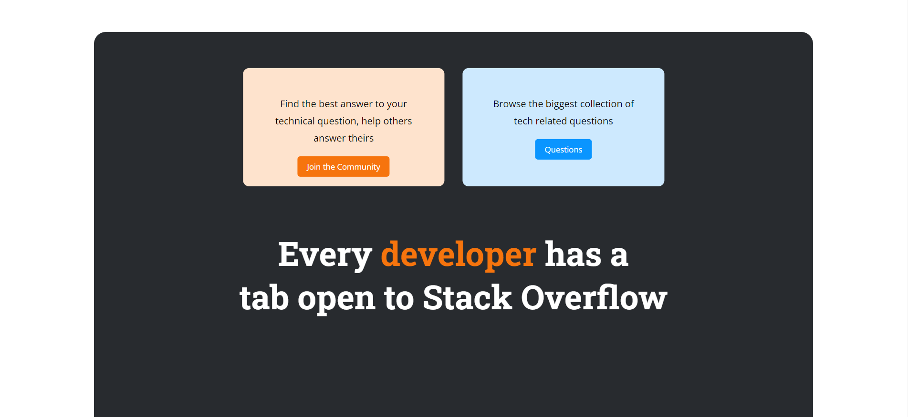
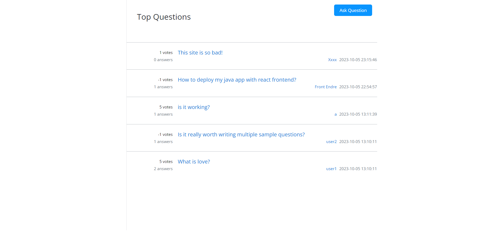

<br />
<div align="center">
  <a href="https://github.com/Tomocza/codecool-stackoverflow">
    
  </a>
</div>
<h3 align="center">Stack overflow-copy</h3>
<p align="left"></p>

## About The Project

Full stack stackoverflow copy!

<!-- TABLE OF CONTENTS -->
<details>
  <summary>Table of Contents</summary>
  <ol>
    <li>
      <a href="#about-the-project">About The Project</a>
      <ul>
        <li><a href="#built-with">Built With</a></li>
      </ul>
    </li>
    <li>
      <a href="#getting-started">Getting Started</a>
      <ul>
        <li><a href="#installation">Installation</a></li>
      </ul>
    </li>
    <li><a href="#features">Features</a></li>
    <li><a href="#authors">Authors</a></li>
  </ol>
</details>


<!-- ABOUT THE PROJECT -->


## Built with

### Frontend:

![React] <br/> ![Tailwind] <br/> ![JavaScript] <br/>

### Backend: <br/>

![Java] <br/> ![SpringBoot]<br/> ![psql]

<p align="right">(<a href="#about-the-project">back to top</a>)</p>

<!-- GETTING STARTED -->
## Getting Started

## Prerequisites

1. JAVA
2. MAVEN
3. INTELLIJ
4. POSTGRESQL
5. NODE

## Installation

1. Clone the repo
   ```shell
   git clone git@github.com:Tomocza/codecool-stackoverflow.git
   ```
2. Install Java version 17 or higher


3. Install Apache Maven or IDE with built-in Maven support


4. Install an integrated development environment(IDE) - IntelliJ IDEA


5. Install PostgreSQL


6. Create a database in PostgreSQL 
    - or run the init.sql file in the out/artifacts.stackoverflow_tw_jar folder


7. Create a .env file in the root folder with the following properties:

   ✅ DB_NAME=your database name

   ✅ DB_USER_NAME=your username

   ✅ DB_PW=your password

   ✅ DB_HOST=(probably localhost)

   ✅ DB_PORT=your db port


8. Run the application by the "Run" button in the top right corner or with Shift + F10 shortcut


10. Navigate to the frontend folder in terminal
     ```shell
     cd .\frontend\my-app
     ```

11. Install the frontend packages
     ```shell
     npm install
     ```

12. Start the application
     ```shell
     npm start
     ```

<p align="right">(<a href="#about-the-project">back to top</a>)</p>


<!-- Features -->

## Features:

1. Homepage
   <br />
<div align="center">
    
</div>

2. User authorization and authentication

3. Posting and answering questions
<br />
<div align="center">
    
</div>

<!-- AUTHORS -->

## Authors


### Bonifert András:

[![Github Pages]](https://github.com/Bonifert)
[![Gmail]](mailto:bonifert.andras@gmail.com)
[![LinkedIn]](https://www.linkedin.com/in/andras-bonifert/)

### Pintér Olivér:

[![Github Pages]](https://github.com/PinterOliver)
[![Gmail]](mailto:pinter.oliver.peter@gmail.com)
[![LinkedIn]](https://www.linkedin.com/in/pinteroliverpeter/)

### Kozák Ádám:

[![Github Pages]](https://github.com/Kozakadam)
[![Gmail]](mailto:kar.adam.robert@gmail.com)
[![LinkedIn]](https://www.linkedin.com/in/kozak-adam-robert/)

### Molnár Tamás
[![Github Pages]](https://github.com/Tomocza)
[![Gmail]](mailto:tomi@astala.hu)
[![LinkedIn]](https://www.linkedin.com/in/tomocza/)


### Tóth Dániel:

[![Github Pages]](https://github.com/Daniel-343)


<p align="right">(<a href="#about-the-project">back to top</a>)</p>


<!-- MARKDOWN LINKS & IMAGES -->
<!-- https://www.markdownguide.org/basic-syntax/#reference-style-links -->

[Tailwind]: https://img.shields.io/badge/Tailwind-000000?style=for-the-badge&logo=TailwindCSS

[JavaScript]: https://img.shields.io/badge/JavaScript-000000?style=for-the-badge&logo=JavaScript

[React]: https://img.shields.io/badge/React-000000?style=for-the-badge&logo=React

[Java]: https://img.shields.io/badge/Java-000000?style=for-the-badge&logo=openjdk

[SpringBoot]: https://img.shields.io/badge/SpringBoot-000000?style=for-the-badge&logo=SpringBoot

[psql]: https://img.shields.io/badge/postgresql-000000?style=for-the-badge&logo=postgresql

[Github Pages]: https://img.shields.io/badge/github-121013?style=for-the-badge&logo=github&logoColor=white

[Gmail]: https://img.shields.io/badge/Gmail-D14836?style=for-the-badge&logo=gmail&logoColor=white

[LinkedIn]: https://img.shields.io/badge/LinkedIn-0077B5?style=for-the-badge&logo=linkedin&logoColor=white